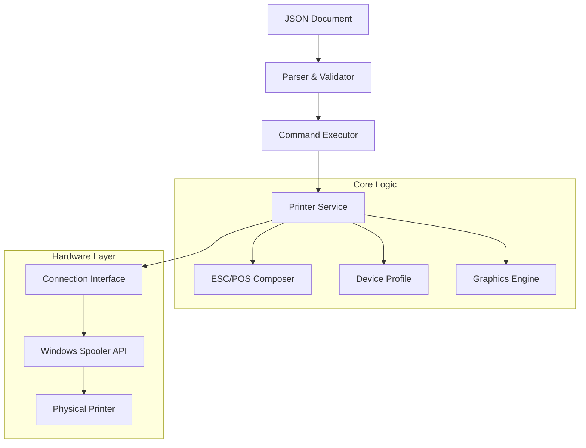

# POS Printer Driver & Utility


A professional, production-ready Go library and command-line utility for controlling ESC/POS thermal printers. Designed
for high-reliability retail and POS environments, it features a robust JSON-based document protocol, native Windows
Spooler integration, and an advanced graphics engine.

## 🚀 Key Features

- **JSON Document Protocol**: Define print jobs using a clean, versioned JSON schema. Decouples business logic from
  hardware commands.
- **Native Windows Integration**: Prints directly via the Windows Print Spooler API (`winspool.drv`), supporting USB,
  Serial, and Network printers installed in Windows.
- **Advanced Graphics Engine**:
    - High-quality image printing with **Atkinson Dithering**.
    - Automatic scaling and aspect ratio preservation.
    - Supports PNG, JPG, BMP.
- **Smart QR & Barcodes**: Automatically chooses between native printer firmware commands (fastest) or software
  rendering (maximum compatibility) based on the printer profile.
- **Dynamic Table Layout**: Built-in engine for generating perfectly aligned receipts with word wrapping and
  multi-column support.
- **Hardware Agnostic**: Includes profiles for standard 80mm (Epson-compatible) and 58mm (generic) printers.

## 🏗️ Architecture

The project follows a layered architecture to ensure modularity and testability:



## 📦 Installation

### Prerequisites

- Go 1.20 or higher
- Windows OS (for native spooler support)

### Build from Source

```bash
# Clone the repository
git clone https://github.com/adcondev/pos-printer.git

# Navigate to the project directory
cd pos-printer

# Build the binary
go build -o pos-printer.exe ./cmd/poster
```

## 📖 Usage

### Command Line Interface (CLI)

The `pos-printer` utility takes a JSON document and sends it to a specified printer.

```bash
# Print a document to a specific printer
pos-printer.exe -file receipt.json -printer "EPSON TM-T88V"

# Dry-run (validate JSON without printing)
pos-printer.exe -file receipt.json -dry-run

# List available command options
pos-printer.exe -help
```

### JSON Document Example

Create a file named `ticket.json`:

```json
{
  "version": "1.0",
  "profile": {
    "model": "Generic 80mm",
    "paper_width": 80
  },
  "commands": [
    {
      "type": "text",
      "data": {
        "content": {
          "text": "STORE NAME",
          "content_style": {
            "bold": true,
            "size": "2x2",
            "align": "center"
          }
        }
      }
    },
    {
      "type": "separator",
      "data": {
        "char": "-"
      }
    },
    {
      "type": "table",
      "data": {
        "definition": {
          "columns": [
            {
              "name": "Item",
              "width": 20,
              "align": "left"
            },
            {
              "name": "Price",
              "width": 10,
              "align": "right"
            }
          ]
        },
        "rows": [
          [
            "Coffee",
            "$3.50"
          ],
          [
            "Sandwich",
            "$8.00"
          ]
        ]
      }
    },
    {
      "type": "qr",
      "data": {
        "data": "https://example.com",
        "align": "center",
        "pixel_width": 150
      }
    },
    {
      "type": "cut",
      "data": {
        "feed": 3
      }
    }
  ]
}
```

### Library Usage (Go)

You can also use the packages directly in your Go application:

```go
package main

import (
	"github.com/adcondev/pos-printer/pkg/composer"
	"github.com/adcondev/pos-printer/pkg/connection"
	"github.com/adcondev/pos-printer/pkg/profile"
	"github.com/adcondev/pos-printer/pkg/service"
)

func main() {
	// 1. Configure Profile
	prof := profile.CreateProfile80mm()

	// 2. Connect to Printer
	conn, _ := connection.NewWindowsPrintConnector("POS-80")
	defer conn.Close()

	// 3. Initialize Service
	proto := composer.NewEscpos()
	printer, _ := service.NewPrinter(proto, prof, conn)
	defer printer.Close()

	// 4. Print
	printer.Initialize()
	printer.PrintLine("Hello World!")
	printer.FullFeedAndCut(2)
}
```

## ⚙️ Configuration

### Connection Types

Currently, the primary supported connection is **Windows Spooler**.

- **Windows**: Uses the OS driver. Best for USB/Network printers installed in Windows.
- *Planned*: Direct Network (Raw TCP/9100) and Serial (COM) support.

### Printer Profiles

The library includes built-in profiles for common hardware:

- `CreateProfile80mm()`: Standard ESC/POS (Epson TM-T88, etc.)
- `CreateProfile58mm()`: Generic 58mm thermal printers.
- `CreatePt210()`: Specific tweaks for PT-210 portable printers.

## 🤝 Contributing

Contributions are welcome! Please feel free to submit a Pull Request.

## 📄 License

This project is licensed under the MIT License - see the LICENSE file for details.
