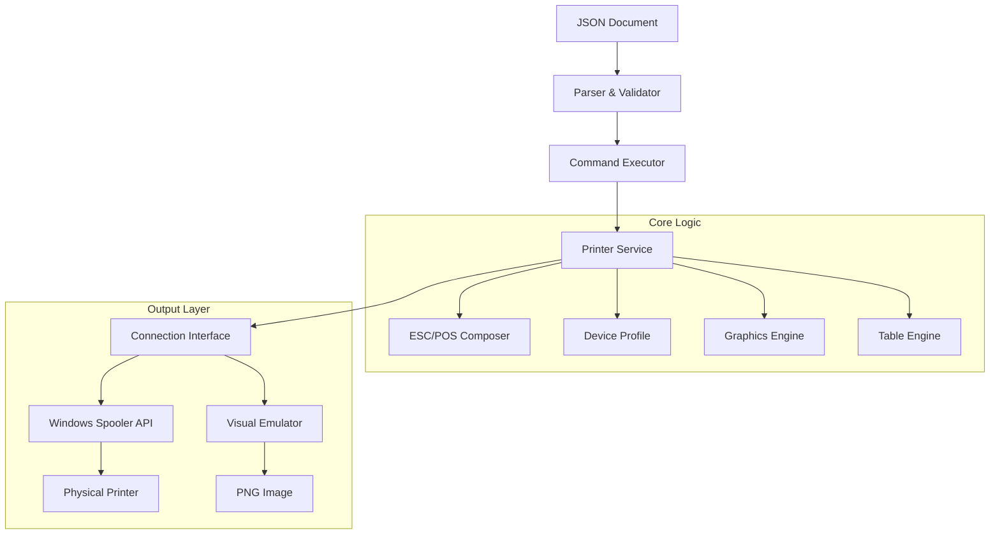

# *Poster: Thermal Printer Driver & ESC/POS Utility*


<p align="center">
  
</p>

A professional, production-ready Go library and command-line utility for controlling ESC/POS thermal printers. Designed for high-reliability retail and POS environments, it features a robust JSON-based document protocol, native Windows Spooler integration, an advanced graphics engine, and a **visual emulator** for testing without physical hardware.

## 🚀 Key Features

- **JSON Document Protocol**: Define print jobs using a clean, versioned JSON schema (`v1.0`). Decouples business logic from hardware commands with full schema validation.
- **Native Windows Integration**: Prints directly via the Windows Print Spooler API (`winspool.drv`), supporting USB, Serial, and Network printers installed in Windows.
- **Advanced Graphics Engine**:
    - High-quality image printing with **Atkinson Dithering**.
    - Automatic scaling with bilinear interpolation.
    - Supports PNG, JPG, BMP formats.
- **Smart QR & Barcodes**: Automatically chooses between native printer firmware commands (fastest) or software rendering (maximum compatibility) based on the printer profile.
- **Dynamic Table Layout**: Built-in engine for generating perfectly aligned receipts with word wrapping, multi-column
  support, configurable spacing, **automatic overflow detection**, and **smart column auto-reduction** that preserves
  small columns while shrinking larger ones to fit paper width.
- **Visual Emulator**: Render print jobs as PNG images for preview and testing without physical hardware.
- **Hardware Agnostic**: Includes profiles for standard 80mm (Epson-compatible), 58mm (generic), and PT-210 portable printers.
- **Raw Command Support**: Send raw ESC/POS bytes when full control is needed.

## 🏗️ Architecture

The project follows a layered architecture to ensure modularity and testability:



### Package Structure

| Package          | Description                                                                                                                         |
|------------------|-------------------------------------------------------------------------------------------------------------------------------------|
| `pkg/commands`   | ESC/POS command implementations (barcode, character, qrcode, etc.)                                                                  |
| `pkg/composer`   | ESC/POS byte sequence generation                                                                                                    |
| `pkg/connection` | Connection interfaces (Windows Spooler, Network, Serial, File)                                                                      |
| `pkg/constants`  | Shared constants and unit conversions                                                                                               |
| `pkg/document`   | Document parsing, building, and execution (schema, builder, executor)                                                               |
| `pkg/emulator`   | Visual emulator for rendering print jobs as images                                                                                  |
| `pkg/graphics`   | Image processing, dithering, and bitmap handling                                                                                    |
| `pkg/profile`    | Printer profiles and character encoding tables                                                                                      |
| `pkg/service`    | High-level printer service facade                                                                                                   |
| `pkg/table`      | Create formatted tables with column alignment, word wrapping, header styling, and automatic width reduction for overflow protection |                                         |

## 📦 Installation

### Prerequisites

- Go 1.24 or higher
- Windows OS (for native spooler support)

### Build from Source

```bash
# Clone the repository
git clone https://github.com/adcondev/poster.git

# Navigate to the project directory
cd poster

# Build the binary
go build -o poster.exe ./cmd/poster
```

## 📖 Usage

### Command Line Interface (CLI)

The `poster` utility takes a JSON document and sends it to a specified printer.

```bash
# Print a document to a specific printer
poster.exe -file receipt.json -printer "EPSON TM-T88V"

# Print via network
poster.exe -t network -network 192.168.1.100:9100 receipt.json

# Print via serial port
poster.exe -t serial -serial COM1 -baud 115200 receipt.json

# Output to file (for debugging or emulator)
poster.exe -t file -output receipt.prn receipt.json

# Dry-run (validate JSON without printing)
poster.exe -file receipt.json --dry-run

# Show version
poster.exe -v

# List available options
poster.exe -h
```

### JSON Document Example

Create a file named `ticket.json`:

```json
{
  "version": "1.0",
  "profile": {
    "model": "Generic 80mm",
    "paper_width": 80,
    "dpi": 203,
    "has_qr": true
  },
  "commands": [
    {
      "type": "text",
      "data": {
        "content": {
          "text": "STORE NAME",
          "content_style": {
            "bold": true,
            "size": "2x2",
            "align": "center"
          }
        }
      }
    },
    {
      "type": "separator",
      "data": {
        "char": "-"
      }
    },
    {
      "type": "table",
      "data": {
        "definition": {
          "columns": [
            { "header": "Item", "width": 20, "align":  "left" },
            { "header":  "Price", "width": 10, "align": "right" }
          ]
        },
        "show_headers": true,
        "rows": [
          ["Coffee", "$3.50"],
          ["Sandwich", "$8.00"]
        ],
        "options": {
          "header_bold": true,
          "word_wrap": true,
          "column_spacing": 1,
          "auto_reduce": true
        }
      }
    },
    {
      "type": "qr",
      "data": {
        "data": "https://example.com",
        "align": "center",
        "pixel_width": 150
      }
    },
    {
      "type": "cut",
      "data": {
        "feed": 3
      }
    }
  ]
}
```

### Library Usage (Go)

You can also use the packages directly in your Go application:

```go
package main

import (
	"github.com/adcondev/poster/pkg/composer"
	"github.com/adcondev/poster/pkg/connection"
	"github.com/adcondev/poster/pkg/profile"
	"github.com/adcondev/poster/pkg/service"
)

func main() {
	// 1. Configure Profile
	prof := profile.CreateProfile80mm()

	// 2. Connect to Printer
	conn, _ := connection.NewWindowsPrintConnector("POS-80")
	defer conn.Close()

	// 3. Initialize Service
	proto := composer.NewEscpos()
	printer, _ := service.NewPrinter(proto, prof, conn)
	defer printer.Close()

	// 4. Print
	printer.Initialize()
	printer.PrintLine("Hello World!")
	printer.FullFeedAndCut(2)
}
```

## 📋 Supported Commands

| Command     | Description                                                         |
|-------------|---------------------------------------------------------------------|
| `text`      | Print formatted text with styles (bold, underline, inverse, sizing) |
| `image`     | Print images with dithering and scaling options                     |
| `barcode`   | Generate barcodes (CODE128, EAN13, UPC-A, CODE39, etc.)             |
| `qr`        | Generate QR codes with optional logos and human-readable text       |
| `table`     | Create formatted tables with column alignment and word wrapping     |
| `separator` | Print separator lines                                               |
| `feed`      | Advance paper by specified lines                                    |
| `cut`       | Perform full or partial paper cut                                   |
| `raw`       | Send raw ESC/POS bytes directly                                     |

For complete documentation, see [api/v1/DOCUMENT_V1.md](api/v1/DOCUMENT_V1.md).

## ⚙️ Configuration

### Connection Types

| Type      | Description                                                                          |
|-----------|--------------------------------------------------------------------------------------|
| `windows` | Windows Print Spooler (default). Best for USB/Network printers installed in Windows. |
| `network` | Direct network connection via Raw TCP/9100                                           |
| `serial`  | Serial/USB direct connection (COM ports)                                             |
| `file`    | Output to file for debugging or emulator testing                                     |

### Printer Profiles

The library includes built-in profiles for common hardware:

| Profile               | Description                                  |
|-----------------------|----------------------------------------------|
| `CreateProfile80mm()` | Standard ESC/POS 80mm (Epson TM-T88, etc.)   |
| `CreateProfile58mm()` | Generic 58mm thermal printers                |
| `CreatePt210()`       | PT-210 portable printer with specific tweaks |

## 🎨 Visual Emulator

The `pkg/emulator` package provides a visual emulator that renders print jobs as PNG images:

```go
import (
	"github.com/adcondev/poster/pkg/emulator"
)

// Create emulator with configuration
emu := emulator.NewEngine(emulator.Config{
	PaperWidth: 80,
	DPI:        203,
})

// Render document and save as PNG
img := emu.Render(document)
emu.SaveImage("receipt_preview.png")
```

## 🤝 Contributing

Contributions are welcome! Please feel free to submit a Pull Request.

## 📄 License

This project is licensed under the MIT License - see the LICENSE file for details.
